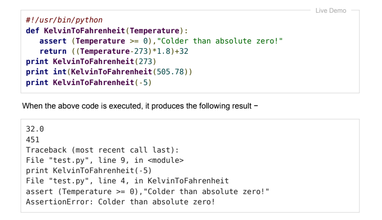

# PRAKTIKUM 9 <br>


# Nama  : Malik Aziz
# Nim   : 312210130
# Kelas : TI.22.B1


# Contoh dan penjelasan modul praktikum 13

1. Berikut adalah fungsi yang mengubah suhu dari derajat kelvin ke derajat fahrenheit. Karena nol derajat kelvin sedingin apa yang di dapat, fungsi tersebut di tebus jika melihat suhu negatif



* Ketika kode di atas di jalankan, muncul Exception yang bernama Traceback. ``Assertionerror`` artinya terjadi error pada pernyataan assert.


2. Contoh ini untuk membuka file, menulis konten di file dan keluar dengan lancar karena tidak ada masalah sama sekali.


* hasilnya: 

``` Written the content in the successfully ```

* hasilnya seperti ini karena else akan di jalankan ketika try adalah true


3. Contoh ini mencoba membuka file dimana anda tidk memiliki izin menulis, sehingga tidak menimbulkan pengecualian.


* mengapa hasilnya error? 
* `r` Adalah `read`, Membuka file untuk membaca, akan error jika file tidak ada. disini ingi membaca file buka untuk menulis file, maka di bawahnya ``fh = open ("testfile","r")`` tambahkan ``print(fh.readline.()) dan fh write di hapus. setelah di jalankan try dan else di tampilkan.

4. Contoh keempat


* Hasil diatas bukan error, karena finally di jalankan ketika try dan except di jalankan. dan berhasil di buat filenya setelah di jalankan.


5. contoh single Exception


* Hasilnya:
  
``` the argument does not contain numbers invalid literal for int() with base 10: 'xyz' ```

* Ketika di jalankan akan muncul error. Hapus ` #!/usr/bin/python` dan di `exception VallueError, Argument:` ganti koma dengan as seperti `exception ValueError as Argument: ` agar tidak error. Jika dijalankan akan muncul error lagi. kenapa? karena paramter def_convert harus mengandung angka.

6. Contoh dan pejelasan ke enam


* Jika dijalankan akan muncul SyntaxError artinya da kesalahan sintaks. pada raise ``"invalid lever", level"`` , gangti tanda koma dengan tanda plus. cetak def dengan angka yang lebih besar dari angka 1.

# Selesai